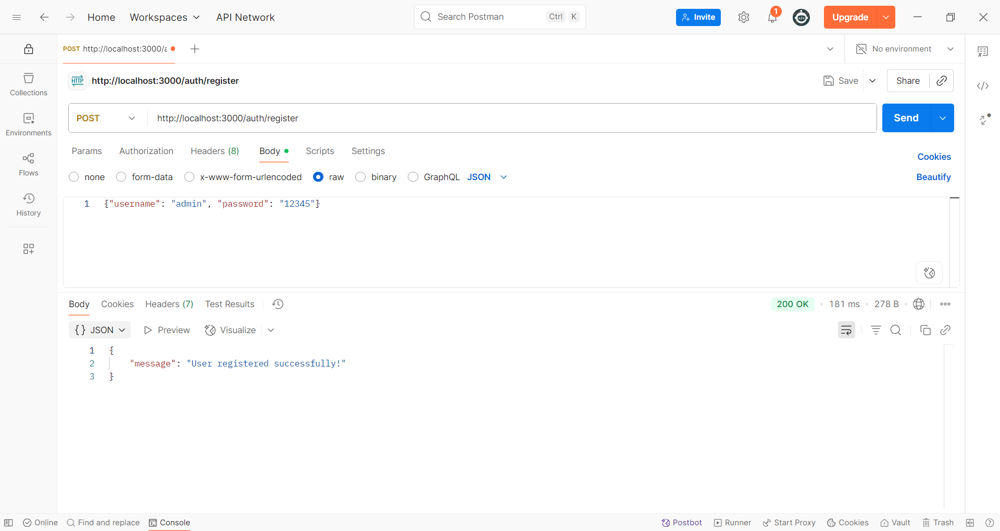
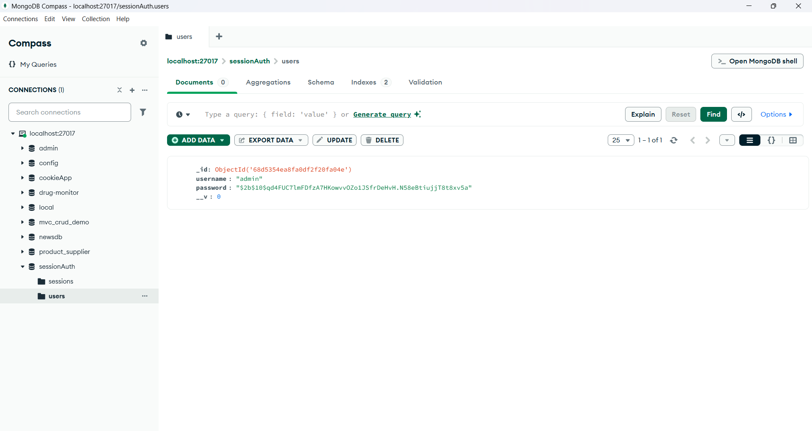
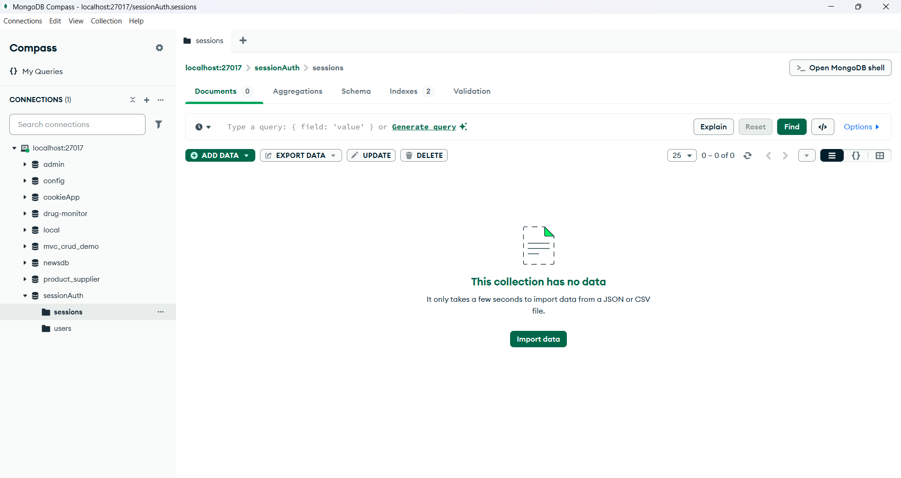
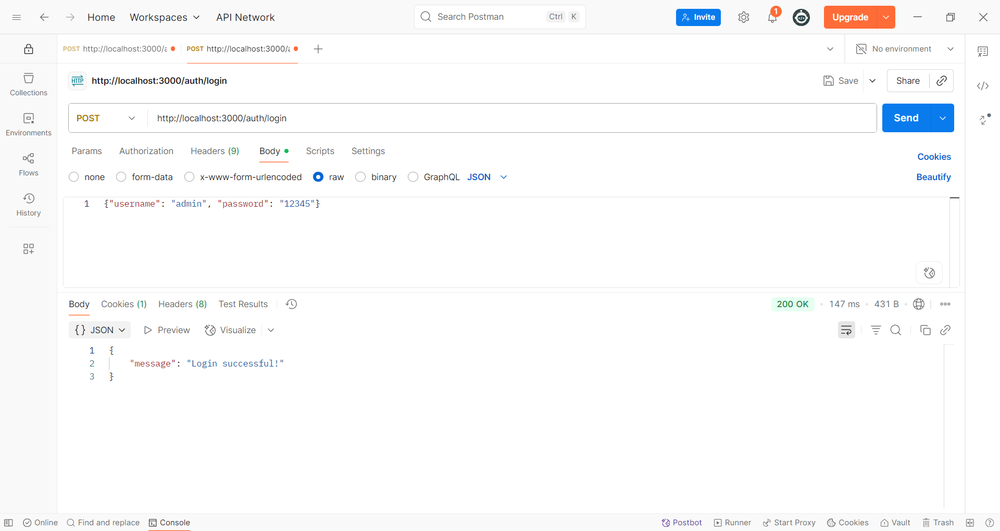
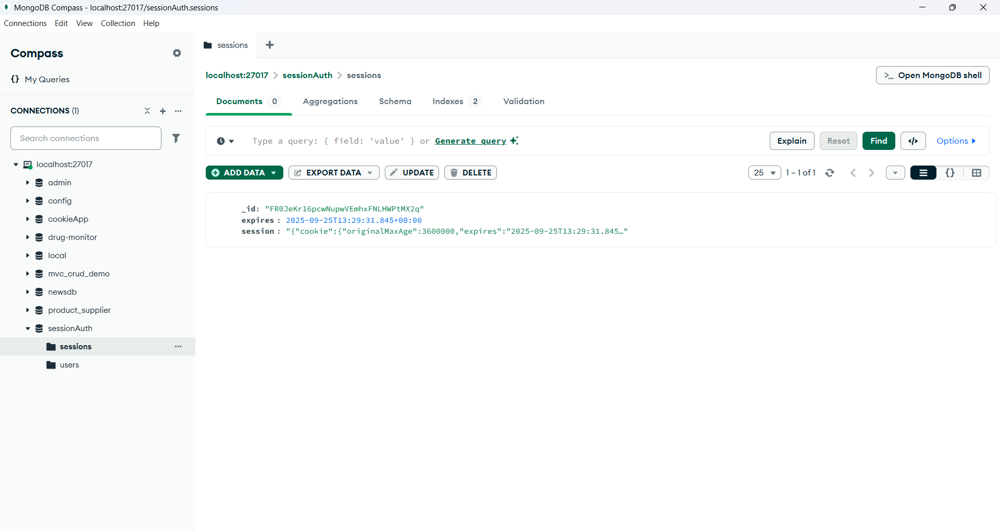
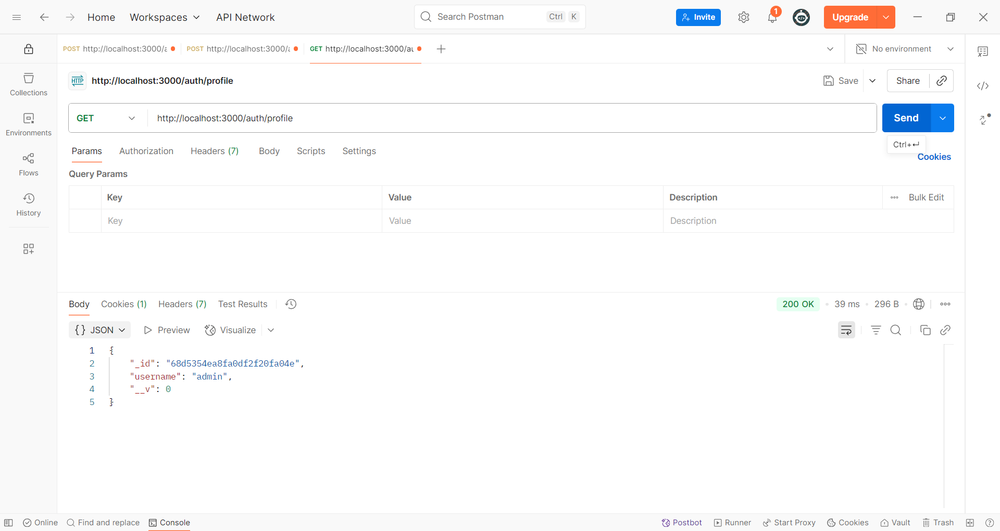
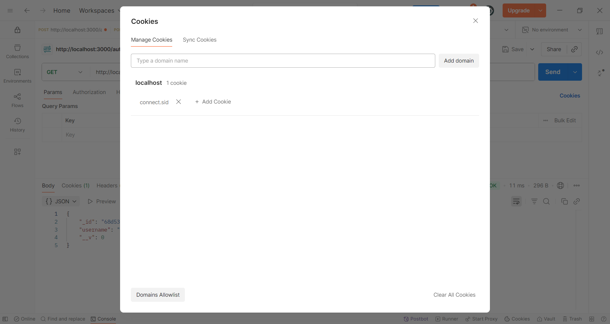
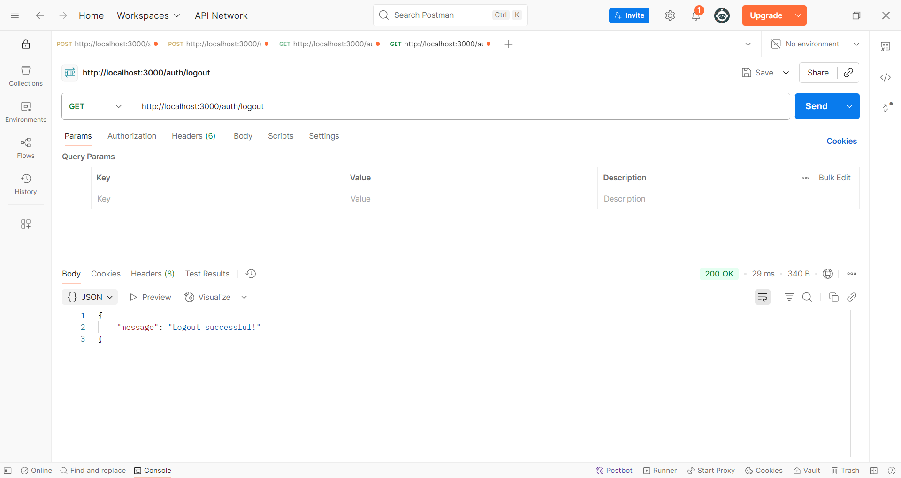

# cookie_session_auth

### a. node app.js

### b. register

Check in database

### c. login 

Check in database

### d. go to profile

### e. go to logout and check cookie is deleted in database

